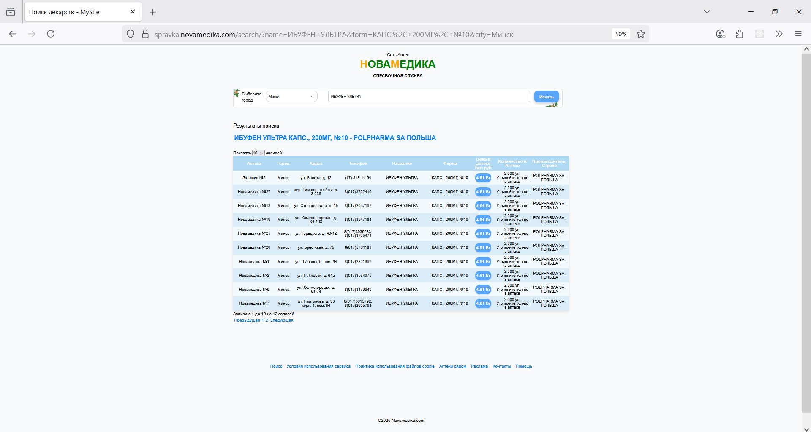
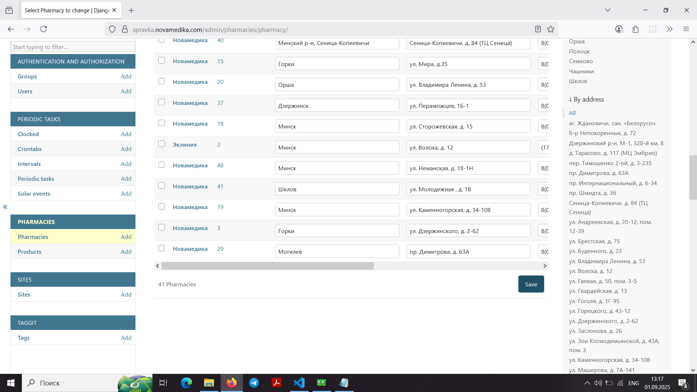
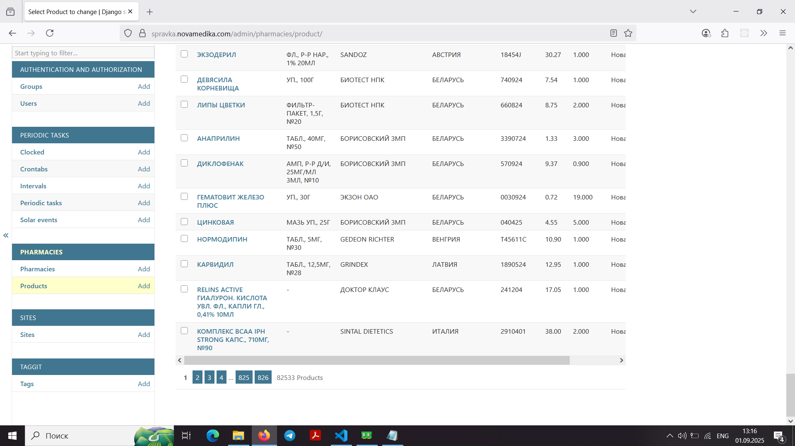

### Платформа мониторинга лекарственных средств "Новамедика"

---

## Обзор проекта
Платформа для отображения в реальном времени наличия лекарственных средств в аптечной сети «Новамедика». Система включает:
- Загрузку и обработку данных из CSV
- Поиск лекарств и аптек
- Интеграцию с Elasticsearch для быстрого поиска
- Фоновую обработку задач с Celery
- REST API для интеграций

---

## Технологический стек
- **Backend**: Django (Python)
- **База данных**: PostgreSQL
- **Поиск**: Elasticsearch 7.x
- **Асинхронные задачи**: Celery + RabbitMQ + Redis
- **Кеширование**: Redis
- **Веб-сервер**: Nginx
- **Оркестрация**: Docker Compose
- **Мониторинг**: Flower

---

## Основные функции
1. **Загрузка данных**
   - Прием CSV-файлов через API
   - Асинхронная обработка данных
   - Валидация и нормализация данных
   - Обновление Elasticsearch в реальном времени

2. **Поиск лекарств**
   - Поиск по названию, форме, производителю
   - Фильтрация по городу
   - Группировка результатов

3. **Управление аптеками**
   - Просмотр списка аптек
   - Детальная информация по аптеке
   - Обновление данных аптек

4. **Администрирование**
   - Мониторинг задач через Flower
   - Управление индексами Elasticsearch
   - Журналирование обработки файлов

---

## Запуск проекта

### Требования
- Docker
- Docker Compose

### Инструкция
1. Скопируйте файлы окружения:
   ```bash
   cp .env.example .env
   ```
   Заполните значения в `.env`

2. Запустите в режиме разработки:
   ```bash
   docker-compose -f docker-compose.dev.yml up --build
   ```

3. Запустите в продакшн-режиме:
   ```bash
   docker-compose -f docker-compose.prod.yml up --build -d
   ```

---

## API Endpoints
### Загрузка CSV
```
POST /api/<pharmacy_name>/<pharmacy_number>/
```
Параметры:
- `file`: CSV-файл с данными

### Проверка статуса задачи
```
GET /api/check_status/<task_id>/
```

### Поиск лекарств
```
GET /search_products?name=...&city=...
```


## Ключевые настройки
### Elasticsearch
Конфигурация в `elasticsearch.yml`:
- Отключена security для разработки
- Оптимизированы настройки памяти
- Настроен healthcheck для Docker

### Nginx
Особенности в `nginx.conf`:
- HTTPS редирект
- Отдача статики и медиафайлов
- Проксирование к Django
- Увеличен лимит загрузки файлов (`client_max_body_size 50M`)

---

## Периодические задачи
Задачи Celery (находятся в `pharmacies/tasks.py`):
1. `update_elasticsearch_index` - частичное обновление индекса (каждые 5 минут)
2. `full_elasticsearch_resync` - полная переиндексация (по требованию)
3. `update_pharmacy_city_in_index` - обновление данных аптек

---

## Модели данных
### Основные сущности (models.py)
1. **Pharmacy** (Аптека)
   - Название, номер, город, адрес
   - Уникальный UUID идентификатор

2. **Product** (Лекарство)
   - Название, форма, производитель
   - Цены (розничная, оптовая)
   - Связь с аптекой
   - Индексы для оптимизации поиска

3. **CsvProcessingTask** (Задача обработки)
   - Статус выполнения
   - Результаты обработки
   - Связь с аптекой

---

## Особенности реализации
1. **Оптимизация Elasticsearch**
   - Кастомные маппинги в `documents.py`
   - Пакетная обработка данных
   - Healthcheck для контейнера

2. **Обработка CSV**
   - Автоопределение кодировки
   - Трансформация данных
   - Удаление дубликатов
   - Атомарные операции

3. **Безопасность**
   - HTTPS в продакшн
   - Защита кук (SameSite, Secure)
   - Аутентификация в Flower

---

## Мониторинг
Доступен по адресу: `http://localhost:5555` (Flower)
- Просмотр выполняемых задач
- Мониторинг воркеров
- Управление периодическими задачами

---

<h2>📸 Скриншоты</h2>

<table>
  <tr>
    <td align="center">
      <a href="./docs/main_page.png">
        
      </a><br>
      Главная страница (HTTPS)
    </td>
    <td align="center">
      <a href="./docs/medicine_name_and_city.png">
        
      </a><br>
      Поиск по названию и городу
    </td>
    <td align="center">
      <a href="./docs/select_dosage_and_form.png">
        
      </a><br>
      Выбор дозировки и формы
    </td>
  </tr>
  <tr>
    <td align="center">
      <a href="./docs/result.png">
        
      </a><br>
      Результаты поиска
    </td>
    <td align="center">
      <a href="./docs/result_full.png">
        
      </a><br>
      Полная страница результатов
    </td>
    <td align="center">
      <a href="./docs/pharmacies_total.png">
        
      </a><br>
      Админ‑панель — список аптек
    </td>
  </tr>
  <tr>
    <td align="center">
      <a href="./docs/products_total.png">
        
      </a><br>
      Админ‑панель — список товаров
    </td>
    <td></td>
    <td></td>
  </tr>
</table>

